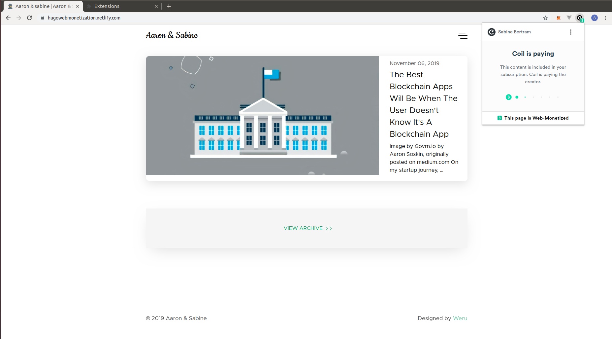
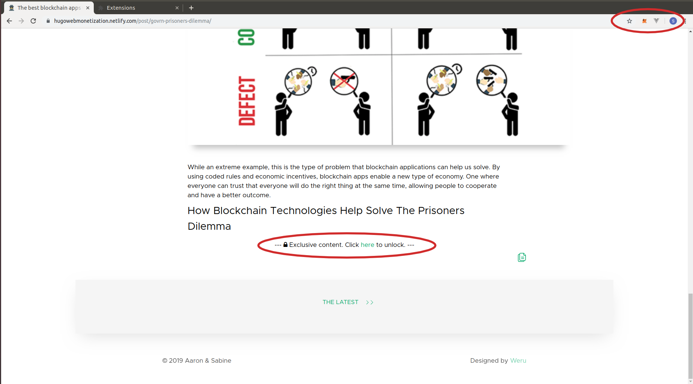

# Webmonetization on Hugo

This repository demos the [Hugo webmonetization theme](https://github.com/sabinebertram/hugo-webmonetization-theme). If the user has a webmonetization extension installed and is streaming micropayments (here: [Coil](https://coil.com/) subscription), exclusive content is unlocked.



Live Demo: https://hugowebmonetization.netlify.com/

Devpost: https://devpost.com/software/hugo-web-monetization

## Deployment

1. Clone the repository
    ```sh
    git clone git@github.com:sabinebertram/hugo-webmonetization-demo.git
    cd hugo-webmonetization-demo
    ```

2. Add the theme
    ```sh
    git submodule add https://github.com/sabinebertram/hugo-webmonetization-theme themes/hugo-webmonetization-theme
    ```

3. [Install Hugo](https://gohugo.io/getting-started/installing/).

4. Start the server
    ```sh
    hugo server
    ```

## How To Enable Webmonetization

Add your [payment pointer](https://webmonetization.org/docs/receiving#payment-pointer) to the `config.toml`:

```
[params]
  monetization = "$twitter.xrptipbot.com/sabinebertram_"
```

## How To Create Exclusive Content

Include the following `<div>` tag in your markdown file:
```html
<div id='exclusive'></div>
```
Everything below this tag will only be visible if the user is streaming payments.

## Screenshots

No webmonetization extension installed.


Webmonetization extension installed.